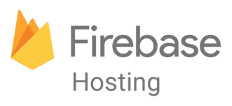

# Lesson 2 - Creating and Deploying the Frontend with Firebase Hosting and Authentication

<figure><figcaption></figcaption></figure>

**Content**​

* Getting Started with Cursor IDE: Introduction to Cursor IDE for streamlined and efficient development with integrated AI coding assistance.
* ​Developing a Single Page Application (SPA): Hands-on building of a basic, responsive SPA using ReactJS and structured components for a cohesive UI.
* ​Firebase Hosting: Deploy the SPA on Firebase Hosting, making the frontend live and accessible.
* ​Implementing Firebase Authentication: Integrate Google SSO with Firebase Authentication to enable secure, user-friendly onboarding.

​**Outcome**

* By the end of Lesson 2, each team will have a hosted frontend with Firebase Authentication set up, enabling user sign-ins with Google SSO.

**References**

* [https://firebase.google.com/docs/auth](https://firebase.google.com/docs/auth)
* [https://www.cursor.com/](https://www.cursor.com/)
* [https://www.purereact.com/](https://www.purereact.com/)

