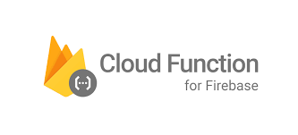

# Lesson 3: Building a Serverless Backend with Firebase Functions

<figure><figcaption></figcaption></figure>

**Content**

* Introduction to Firebase Functions: Understanding serverless architecture and how Firebase Functions can serve as the backend.
* ​Setting Up Backend Logic: Create and deploy Firebase Functions to handle backend tasks, like processing requests and handling AI interactions.
* ​Connecting Frontend and Backend: Establish communication between the frontend SPA and Firebase Functions to complete the app’s core functionality.
* ​Basic Data Processing with Firebase Functions: Implement data handling techniques within Firebase Functions for seamless AI-powered responses.

​**Outcome**

* Teams will have a functional serverless backend connected to their frontend, enabling interactions and data processing.

**References**

* [https://firebase.google.com/docs/functions](https://firebase.google.com/docs/functions)

\
